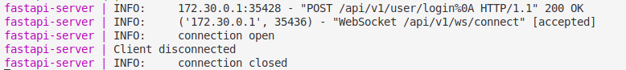

# FastAPI Mock Server
- Based on FastAPI production template: https://github.com/teamhide/fastapi-boilerplate.git
- FastAPI + Poetry setup Dockerized
- Run with single docker-compose command

## Features
- Async SQLAlchemy session
- Custom user class
- Dependencies for specific permissions
- Celery
- Dockerize(Hot reload)
- Event dispatcher
- Cache

## Run with Docker Compose

### Install
Tested on Ubuntu 22.04. Check [here](https://docs.docker.com/engine/install/) for other platforms.
```shell
sudo apt-get update
sudo apt-get install docker.io -y
sudo systemctl start docker
sudo systemctl enable docker
sudo groupadd docker
sudo usermod -aG docker $USER

sudo curl -L https://github.com/docker/compose/releases/latest/download/docker-compose-$(uname -s)-$(uname -m) -o /usr/local/bin/docker-compose
sudo chmod +x /usr/local/bin/docker-compose
docker-compose version
```

### Run 
```shell
docker-compose up --build
```
## Test endpoints

### REST API
- Check documentation: http://localhost:8000/docs

Sample login request after creating user
```shell
curl -X 'POST' \
  'http://localhost:8000/api/v1/user/login' \
  -H 'accept: application/json' \
  -H 'Content-Type: application/json' \
  -d '{
  "email": "user@example.com",
  "password": "password"
}'
```

Sample login response
```shell
{
    "token": "eyJhbGciOi...",
    "refresh_token": "eyJhbGci..."
}
```

### Websocket
- Connect route: ws://localhost:8000/api/v1/ws/connect

Websocket connection with Bearer token provided
